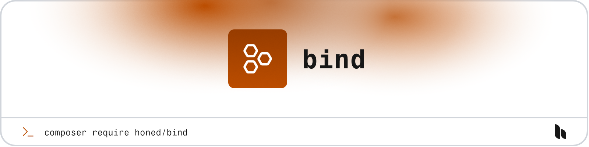

<a href="https://honed.dev/binding">
    <picture>
        <source media="(prefers-color-scheme: dark)" srcset="art/header-dark.png">
        
    </picture>
</a>

# Binding

<p>
    <a href="https://github.com/honedlabs/binding/actions"></a>
    <a href="https://packagist.org/packages/honed/binding"></a>
    <a href="https://packagist.org/packages/honed/binding"></a>
</p>

**Binding** is a lightweight package that optimizes how models are retrieved via route model binding in Laravel for a specific route.

## Installation

> **Requires [PHP 8.2+](https://php.net/releases/)**

> **Requires [Laravel 11+](https://laravel.com/docs/releases).**

Get started with the package by requiring it in your PHP project using [Composer](https://getcomposer.org/).

```bash
composer require honed/binding
```

## Documentation

Please refer to the [documentation](https://honed.dev/binding) for the usage of the package.

## License

**Binding** was created by [Joshua Wallace](https://joshua-wallace.com) under the [MIT license](https://opensource.org/licenses/MIT).