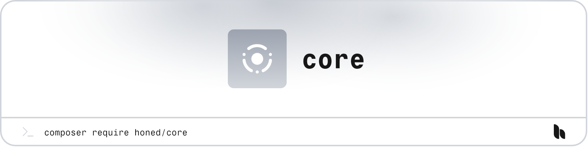

> **Caution:** This package is currently under development and not ready for production use. Tag v1.0.0 will indicate a stable release.

<a href="https://honed.dev/core">
	<picture>
		<source media="(prefers-color-scheme: dark)" srcset="art/header-dark.png">
		
	</picture>
</a>

# Core

<p>
    <a href="https://github.com/honedlabs/core/actions"></a>
    <!-- <a href="https://github.com/honedlabs/core/actions"></a> -->
    <a href="https://packagist.org/packages/honed/core"></a>
    <a href="https://packagist.org/packages/honed/core"></a>
</p>

**Core** provides composable building blocks to develop serializable classes for PHP, as well as generic helpers for your applications.

## Installation

> **Requires [PHP 8.2+](https://php.net/releases/)**

> **Requires [Laravel 11+](https://laravel.com/docs/releases).**

Get started with the package by requiring it in your PHP project using [Composer](https://getcomposer.org/).

```bash
composer require honed/core
```

## Documentation

Please refer to the [documentation](https://honed.dev/core) for the usage of the package.

## License

**Core** was created by [Joshua Wallace](https://joshua-wallace.com) under the [MIT license](https://opensource.org/licenses/MIT).