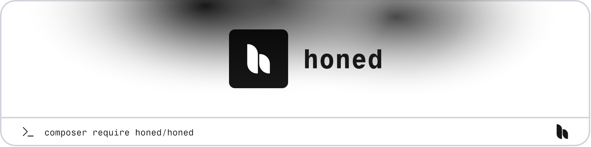

<a href="https://honed.dev/honed">
    <picture>
        <source media="(prefers-color-scheme: dark)" srcset="art/header-dark.png">
        
    </picture>
</a>

# Honed

<p>
    <a href="https://github.com/honedlabs/honed/actions"></a>
    <a href="https://packagist.org/packages/honed/honed"></a>
    <a href="https://packagist.org/packages/honed/honed"></a>
</p>

**Honed** provides commonly use Honed packages in a single command, allowing you to accelerate monolith development using the package ecosystem.

## Installation

> **Requires [PHP 8.2+](https://php.net/releases/)**

> **Requires [Laravel 11+](https://laravel.com/docs/releases).**

Get started with the package by requiring it in your PHP project using [Composer](https://getcomposer.org/).

```bash
composer require honed/honed
```

## Documentation

Please refer to the [documentation](https://honed.dev/honed) for the usage of the package.

## License

**Honed** was created by [Joshua Wallace](https://joshua-wallace.com) under the [MIT license](https://opensource.org/licenses/MIT).